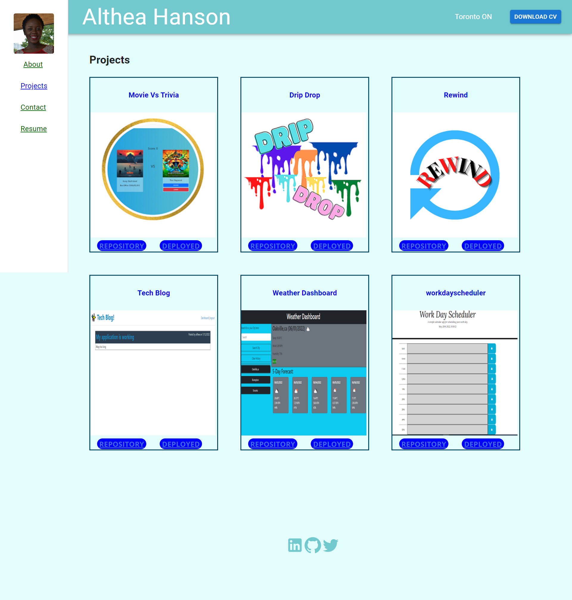
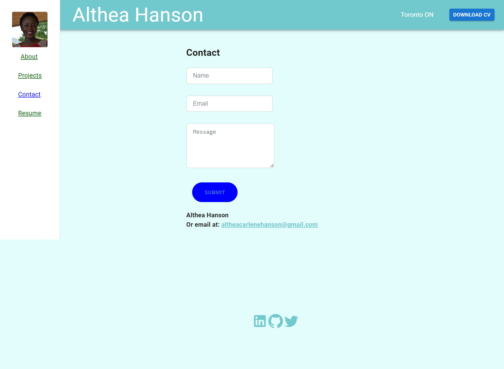
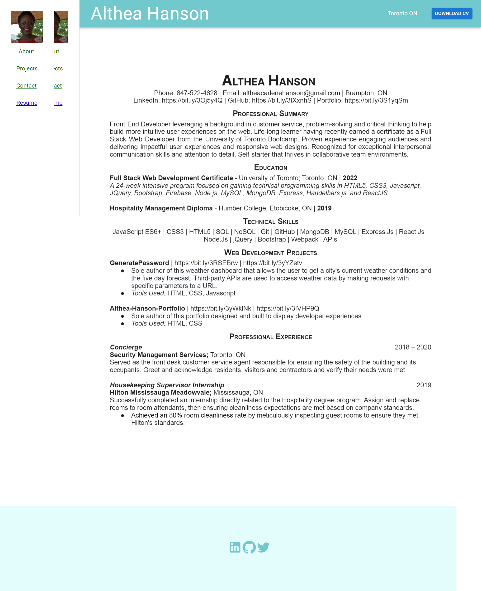

## My React Portfolio

## Description
- This portfolio was created from scratch to showcase my skills using React 

## Expectations
- You will find..
GIVEN a single-page application portfolio for a web developer
WHEN I load the portfolio
THEN I am presented with a page containing a header, a section for content, and a footer
WHEN I view the header
THEN I am presented with the developer's name and navigation with titles corresponding to different sections of the portfolio
WHEN I view the navigation titles
THEN I am presented with the titles About Me, Portfolio, Contact, and Resume, and the title corresponding to the current section is highlighted
WHEN I click on a navigation title
THEN I am presented with the corresponding section below the navigation without the page reloading and that title is highlighted
WHEN I load the portfolio the first time
THEN the About Me title and section are selected by default
WHEN I am presented with the About Me section
THEN I see a recent photo or avatar of the developer and a short bio about them
WHEN I am presented with the Portfolio section
THEN I see titled images of six of the developer’s applications with links to both the deployed applications and the corresponding GitHub repositories
WHEN I am presented with the Contact section
THEN I see a contact form with fields for a name, an email address, and a message
WHEN I move my cursor out of one of the form fields without entering text
THEN I receive a notification that this field is required
WHEN I enter text into the email address field
THEN I receive a notification if I have entered an invalid email address
WHEN I am presented with the Resume section
THEN I see a link to a downloadable resume and a list of the developer’s proficiencies
WHEN I view the footer
THEN I am presented with text or icon links to the developer’s GitHub and LinkedIn profiles, and their profile on a third platform (Stack Overflow, Twitter)

## Table of Contents
- [Installation](#installation)
- [Menu Area](#menu-area)
- [References](#references)
- [Deployed Site Link](#deployed-site)
- [Wireframe Drawing](#wireframe)

## Menu Areas
- About 
    - Here you will find information about me and my journey as a developer
- Projects
    - Here you will find a list of projects i have completed and links to projects pages to explore my results as well as the code behind each project
- Contact
    - If you would like to contact me, this form is where i can be reached
- Resume
    - A pdf display of my resume, with a link to download it on the header tab

## References

## Deployed Site/ Github Pages
https://altheahanson.github.io/MyReactPortfolio/

